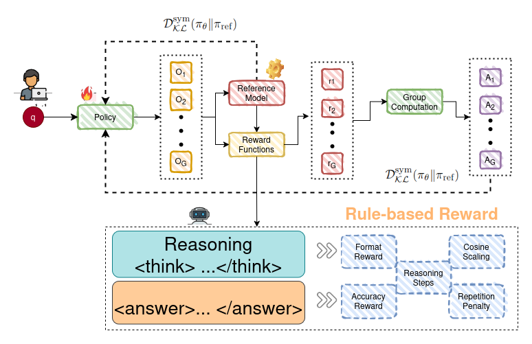
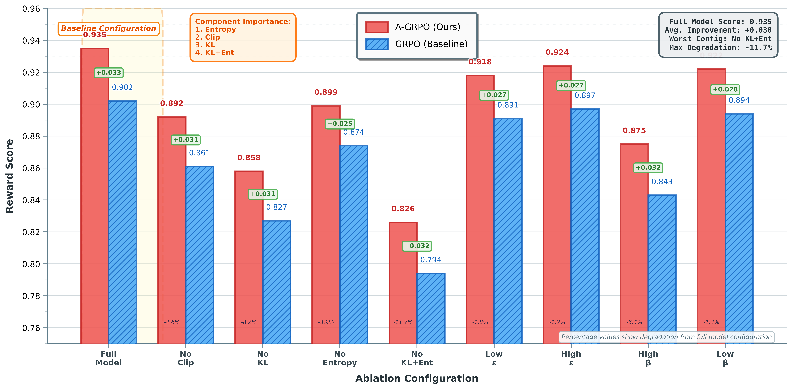
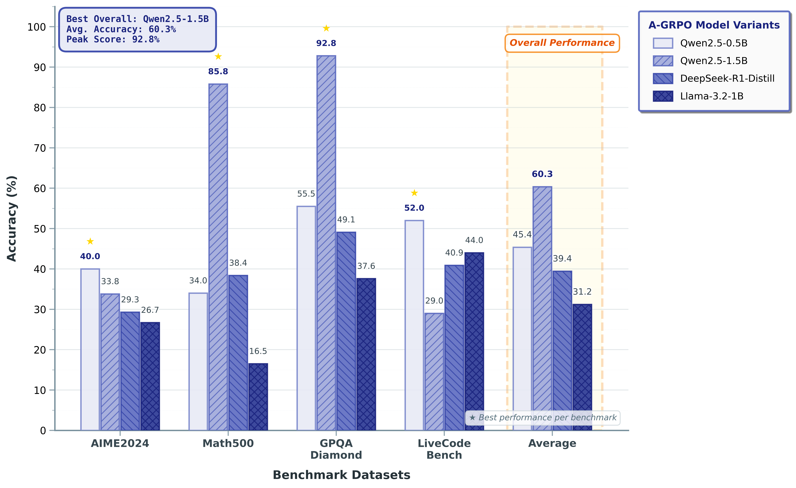
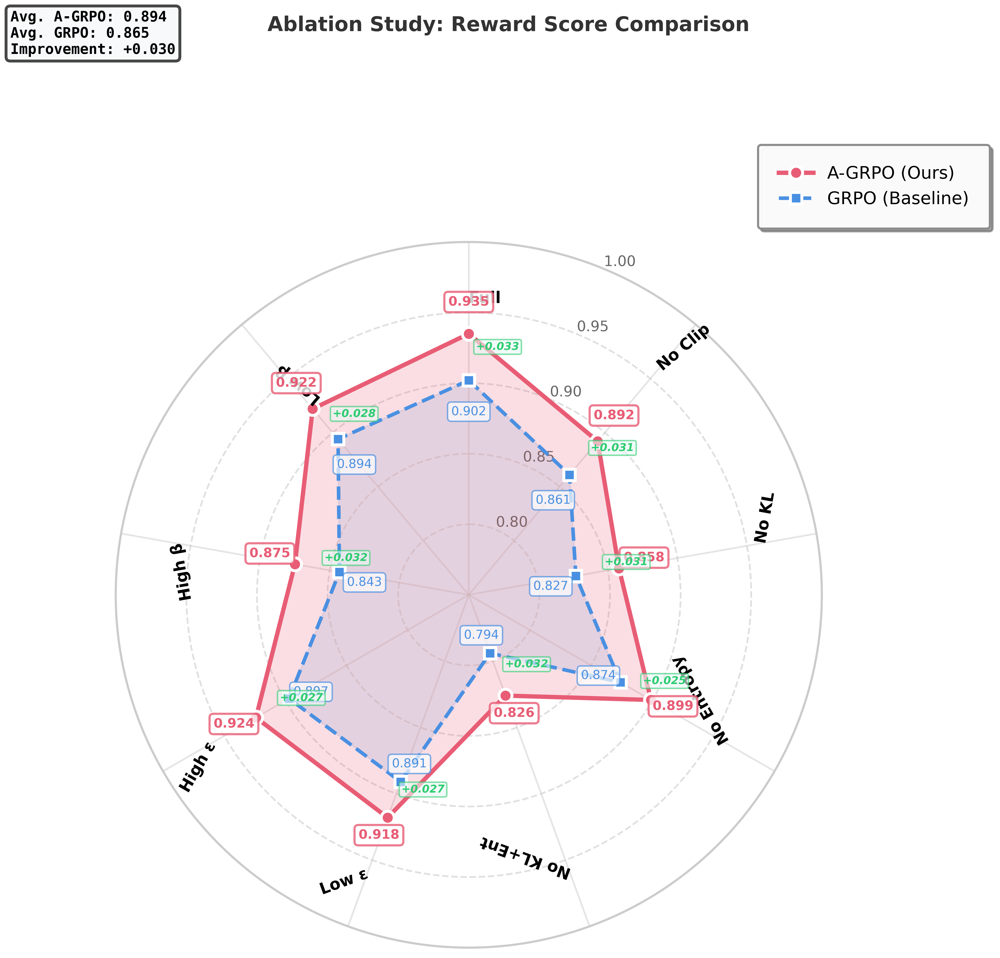
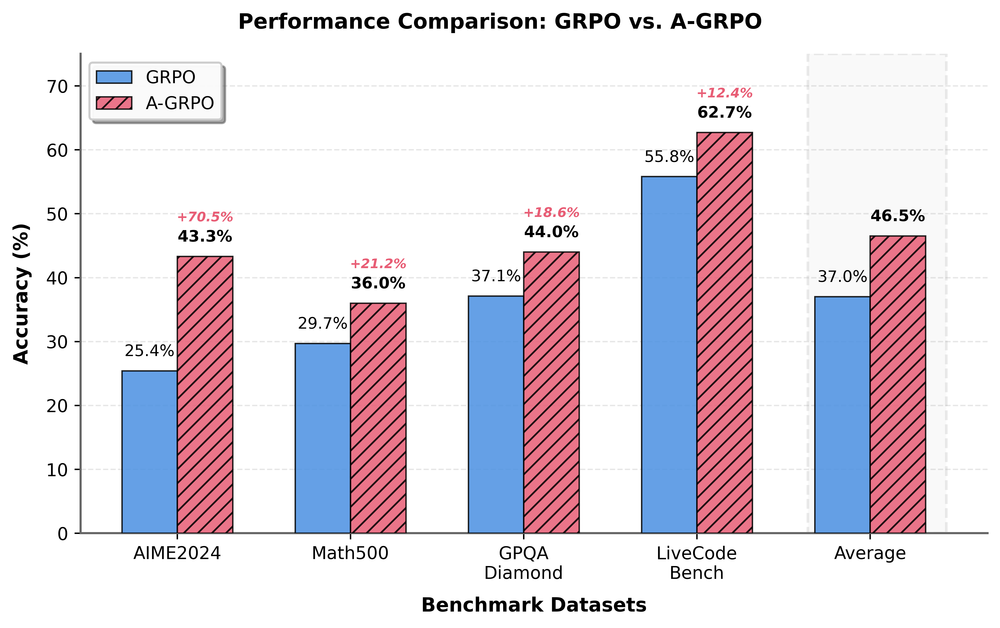

# A-GRPO: Adaptive Group Relative Policy Optimization for Scalable and Stable Reinforcement Fine-Tuning of Large Language Models.

  - **Corresponding authors:**  [Theophilus Siameh](https://www.linkedin.com/in/theophilus-siameh-793a8626/), [Abigail Akosua Addobea](https://www.linkedin.com/in/madam-akosua-addobea08/), [Liu Chung-Hung](https://www.linkedin.com/in/qing-yang-b3a02120b/),[Eric Kudjoe Fiah](https://www.linkedin.com/in/eric-fiah-3815b1157/)

[](https://opensource.org/licenses/MIT) [](https://github.com/zzli2022/System2-Reasoning-LLM)[]()
<!-- 
[](https://arxiv.org/pdf/2502.21321) -->

<!-- <p align="center">
<a href="https://arxiv.org/abs/2503.22342"> </a> 
</p> -->


<p align="center">
    
</p>

## Abstract
We introduce a new class of reinforcement learning (**RL**) methods called **Adaptive Group Relative Policy Optimization** (**A-GRPO**), an enhanced variant of Group Relative Policy Optimization (**GRPO**) proposed initially in DeepSeek-R1 (a rule-based reward paradigm) that suffers from several optimization limitations. To overcome these issues, we propose a novel objective function that balances the policy update term with a symmetric $KL$-divergence penalty, using adaptive hyperparameters $\beta_t$ and $\epsilon_t$ as clipping thresholds. The method dynamically adjusts the $KL$-divergence coefficient $\beta_t$ based on the moving average of the $KL$-divergence, preventing instability during optimization. We further highlight the critical role of promoting exploration by incorporating entropy regularization with an appropriately chosen coefficient. In essence, our approach integrates several key techniques, i.e., advantage computation, symmetric $KL$-divergence, and adaptive hyperparameter scheduling, that together make **A-GRPO** effective for large-scale LLM-based (**RL**). Through experiments on benchmark tasks, we show that **A-GRPO** outperforms conventional policy gradient methods, offering a strong balance between **efficiency**, **adaptation**, **stability**, **simplicity**, and **performance**. Both theoretical analysis and empirical evidence demonstrate that **A-GRPO** provides a robust framework for contrasting preferred and dispreferred responses in **RL** across diverse model sizes ranging from $0.5B$ to $1.5B$ parameters. Our results further indicate that **A-GRPO** effectively fine-tunes language models (LMs) to align with human preferences, achieving performance comparable to or exceeding current state-of-the-art methods.


## Training Pipeline
Training pipeline of the Adaptive Group Relative Policy Optimization (**A-GRPO**) Algorithm. The proposed framework generates multiple reasoning-based responses and optimizes them using symmetric $\mathcal{KL}$-divergence, with advantage estimation guided by weighted normalization of reward signals.
<p align="center">
  
</p>

---

## Main Results

### Ablation Study

Win Rate Comparison (**A-GRPO** vs **GRPO**). Bar chart comparing the Win Rate (\%) across different ablation configurations for **A-GRPO** and **GRPO**. **A-GRPO** consistently outperforms **GRPO** across all cases, demonstrating greater robustness and effectiveness under component removal.
<p align="center">
  
</p>

---


Performance Comparison of **A-GRPO** and **GRPO** models across reasoning benchmarks: Comparative Accuracy of **Qwen2.5-Math-1.5B-Instruct** model across diverse reasoning benchmark datasets. Each group of bars represents performance across four benchmarks, with different models shown in distinct colors.
<p align="center">
  
</p>

---

Radar Plot (**A-GRPO** vs **GRPO**). **A-GRPO** consistently covers more area, showing stronger performance across most configurations. The shape illustrates robustness - especially where **A-GRPO** maintains high reward under challenging ablations like **No KL** or **No Entropy**.
<p align="center">
  
</p>

---

Bar Plot: Performance Comparison of **GRPO** and **A-GRPO** models across reasoning benchmarks: Comparative Accuracy of **Qwen2.5-Math-1.5B-Instruct** model across diverse reasoning benchmark datasets. Each group of bars represents performance across four benchmarks, with different models shown in distinct colors.
<p align="center">
  
</p>

---


## Ablation Study on GRPO Objective

Removing or altering clipping (ε), KL penalty (β), entropy regularization (η), or varying group size (G) impacts learning stability, diversity, and alignment. Group size controls the number of sampled trajectories per query during training. **Bolded** values represent best results; *italicized gray* values denote worst results.

| Configuration               | Win ↑    | Reward ↑ | KL ↓   | Ent. ↑ | Len.  | Notes                                                   |
|----------------------------|----------|----------|--------|--------|-------|---------------------------------------------------------|
| **Full GRPO (Baseline)**   | **76.1%**| **0.902**| 1.26   | 2.39   | 51.8  | Original GRPO with all components                      |
| No clipping (ε → ∞)        | 70.3%    | 0.861    | 1.75   | 2.79   | 56.0  | Unstable training, unbounded updates                   |
| No KL penalty (β = 0)      | 66.5%    | 0.827    | **3.12**| 2.87  | **59.7**| High divergence from reference policy                 |
| No entropy bonus (η = 0)   | 72.5%    | 0.874    | 1.31   | **1.93**| 48.7 | Reduced exploration, more deterministic                |
| No KL, No entropy          | *62.0%*  | *0.794*  | *3.34* | *1.79* | 47.9  | Severe performance drop, mode collapse                 |
| Low ε = 0.1                | 73.5%    | 0.891    | **1.18**| 2.33  | 50.9  | Stable but slower convergence                          |
| High ε = 0.5               | 74.7%    | 0.897    | 1.38   | 2.41   | **52.5**| Balanced, slightly noisier updates                   |
| High β = 1.0               | 68.4%    | 0.843    | **0.81**| 2.34  | 50.5  | Over-regularized, stifled learning                     |
| Low β = 0.1                | 74.9%    | 0.894    | 1.51   | **2.44**| 52.4 | Improved reward with moderate KL rise                 |
| Group size G=4             | *71.0%*  | *0.860*  | **1.12**| 2.15  | 50.2  | Lower diversity, less robust learning across samples   |
| Group size G=8             | 75.3%    | 0.895    | 1.24   | **2.42**| 51.5 | Balanced performance with modest computational cost    |
| Group size G=16            | **77.2%**| **0.908**| 1.38   | 2.55   | 52.8  | Improved sample efficiency and stability at higher cost|

## Ablation Study on A-GRPO Objective

Removing or altering clipping (εₜ), KL penalty (βₜ), entropy regularization (η), or varying group size (G) affects stability, expressiveness, and reference adherence. Larger group sizes generally improve stability and sample diversity. **Bold** values represent best results; *italic gray* values denote worst results.

| Configuration                | Win ↑     | Reward ↑ | KL ↓   | Ent. ↑ | Len.  | Notes                                                  |
|-----------------------------|-----------|----------|--------|--------|-------|--------------------------------------------------------|
| **Full A-GRPO (Proposed)**  | **78.4%** | **0.921**| 1.15   | 2.45   | 52.3  | Baseline with all components                          |
| No clipping (εₜ → ∞)        | 72.1%     | 0.878    | 1.62   | 2.81   | 56.1  | Unstable updates, higher variance                     |
| No KL penalty (βₜ = 0)      | 68.9%     | 0.843    | **2.97**| 2.91  | **60.4**| Model drifts from reference distribution             |
| No entropy bonus (η = 0)    | 74.0%     | 0.889    | 1.20   | **1.96**| 49.0 | Less diverse and shorter generations                 |
| No KL, No entropy           | *64.7%*   | *0.812*  | *3.25* | *1.83* | 48.5  | Significant degradation in performance and control    |
| Low εₜ = 0.1                | 75.2%     | 0.906    | **1.11**| 2.38  | 51.7  | Conservative, stable updates but slightly reduced reward |
| High εₜ = 0.5               | 76.3%     | 0.913    | 1.28   | 2.43   | **52.6**| Slightly riskier updates, better reward              |
| High βₜ = 1.0               | 70.5%     | 0.864    | **0.87**| 2.40  | 51.1  | Over-regularized towards reference model             |
| Low βₜ = 0.1                | 76.5%     | 0.910    | 1.45   | **2.51**| 53.0 | Good balance of freedom and constraint               |
| Group size G=4              | *72.3%*   | *0.879*  | **1.09**| 2.21  | 50.5  | Less robust group dynamics, reduced generalization   |
| Group size G=8              | 77.3%     | 0.912    | 1.20   | **2.47**| 52.0 | Balanced stability and expressiveness                |
| Group size G=16             | **79.1%** | **0.928**| 1.33   | 2.58   | 53.2  | Highest performance, more stable yet costlier sampling |


## Extended Side-by-Side Ablation Comparison: A-GRPO vs GRPO

Larger group size (G) improves stability and reward across both models. A-GRPO maintains stronger performance overall. **Bold** values indicate best results; *italic gray* values indicate worst results.

| Configuration               | A-GRPO Win ↑ | A-GRPO Reward ↑ | A-GRPO KL ↓ | GRPO Win ↑ | GRPO Reward ↑ | GRPO KL ↓ | Notes                                                    |
|----------------------------|---------------|------------------|--------------|-------------|----------------|-------------|----------------------------------------------------------|
| **Full Objective (Baseline)** | **78.4%**     | **0.921**         | 1.15         | 76.1%       | 0.902          | 1.26        | A-GRPO performs slightly better across all metrics       |
| No clipping (εₜ → ∞)       | 72.1%         | 0.878            | 1.62         | 70.3%       | 0.861          | 1.75        | A-GRPO more stable under large updates                   |
| No KL penalty (βₜ = 0)     | 68.9%         | 0.843            | **2.97**     | 66.5%       | 0.827          | **3.12**    | Both models diverge; A-GRPO retains better reward        |
| No entropy bonus (η = 0)   | 74.0%         | 0.889            | 1.20         | 72.5%       | 0.874          | 1.31        | A-GRPO retains higher reward and lower KL                |
| No KL, no entropy          | *64.7%*       | *0.812*          | *3.25*       | *62.0%*     | *0.794*        | *3.34*      | Worst-case ablation; A-GRPO still leads                  |
| Low εₜ = 0.1               | 75.2%         | 0.906            | **1.11**     | 73.5%       | 0.891          | **1.18**    | Both stable; A-GRPO slightly better                      |
| High εₜ = 0.5              | 76.3%         | 0.913            | 1.28         | 74.7%       | 0.897          | 1.38        | A-GRPO handles broader clipping better                   |
| High βₜ = 1.0              | 70.5%         | 0.864            | **0.87**     | 68.4%       | 0.843          | **0.81**    | GRPO over-regularized, worse reward                      |
| Low βₜ = 0.1               | 76.5%         | 0.910            | 1.45         | 74.9%       | 0.894          | 1.51        | A-GRPO achieves better trade-off                         |
| Group size G = 4           | *72.3%*       | *0.879*          | **1.09**     | *71.0%*     | *0.860*        | **1.12**    | Smaller G = less robust generalization                   |
| Group size G = 8           | 77.3%         | 0.912            | 1.20         | 75.3%       | 0.895          | 1.24        | Balanced performance, moderate cost                      |
| Group size G = 16          | **79.1%**     | **0.928**         | 1.33         | **77.2%**   | **0.908**      | 1.38        | Highest stability and reward, more compute               |


## Comparison of A-GRPO with Other Policy Optimization Methods

| Method              | Grouping   | KL Constraint            | Normalization         | Adaptive Hyperparameters | Exploration             |
|---------------------|------------|---------------------------|------------------------|---------------------------|--------------------------|
| PPO                 | No         | Unidirectional KL         | No                     | No                        | Limited                  |
| GRPO                | Fixed      | Unidirectional KL         | No                     | No                        | Limited                  |
| **A-GRPO (Ours)**   | **Adaptive** | **Symmetric KL**         | **Weighted & Global**  | **Yes**                   | **Entropy Regularization** |


## Datasets and Models Used in Experiments

| Dataset                         | Description                                                                                 | Models Tested                                 |
|----------------------------------|---------------------------------------------------------------------------------------------|------------------------------------------------|
| **AI-MO/NuminaMath-CoT**        | • ~80k training problems  <br> • ~100 test samples <br> • Focus on numerical reasoning and <br> tool-integrated reasoning (TIR) | Qwen2.5-0.5B-Instruct  <br> Qwen2.5-1.5B-Instruct <br> DeepSeek-R1-Distill-Qwen-1.5B <br> Llama-3.2-1B-Instruct |
| **bespokelabs/Bespoke-Stratos-17k** | • ~16.6k training samples  <br> • No dedicated test set <br> • Includes questions, reasoning traces, and answers | Qwen2.5-0.5B-Instruct  <br> Qwen2.5-1.5B-Instruct <br> DeepSeek-R1-Distill-Qwen-1.5B <br> Llama-3.2-1B-Instruct |
| **openai/gsm8k**                | • 7.47k training samples <br> • 1.32k test samples <br> • Elementary school math problems <br> • Linguistically diverse | Qwen2.5-0.5B-Instruct  <br> Qwen2.5-1.5B-Instruct <br> DeepSeek-R1-Distill-Qwen-1.5B <br> Llama-3.2-1B-Instruct |


## Model Training Configuration

### 🔧 Model Arguments
| Parameter               | Value                          |
|-------------------------|--------------------------------|
| `model_name_or_path`    | Qwen/Qwen2.5-0.5B-Instruct     |
| `attn_implementation`   | flash_attention_2              |

### 📊 Dataset Arguments
| Parameter               | Value          |
|-------------------------|----------------|
| `dataset_id_or_path`    | openai/gsm8k   |

### 🧱 LoRA Arguments
| Description             |
|-------------------------|
| No LoRA is used here    |

### 🏋️ Training Arguments
| Parameter                       | Value         |
|----------------------------------|---------------|
| `max_steps`                      | 450           |
| `batch_size`                     | 16            |
| `per_device_train_batch_size`    | 1             |
| `gradient_accumulation_steps`    | 8             |
| `gradient_checkpointing`         | true          |
| `learning_rate`                  | 5.0e-7        |
| `lr_scheduler_type`              | cosine        |
| `warmup_ratio`                   | 0.03          |
| `beta`                           | 0.001         |
| `max_prompt_length`              | 256           |
| `max_completion_length`          | 1024          |
| `num_generations`                | 8             |
| `use_vllm`                       | true          |
| `vllm_gpu_memory_utilization`    | 0.5           |

### 📈 Logging Arguments
| Parameter         | Value                 |
|-------------------|------------------------|
| `logging_steps`   | 2                     |
| `report_to`       | tensorboard/wandb     |
| `save_strategy`   | steps                 |
| `save_steps`      | 25                    |

### 🧩 Hugging Face Hub
| Parameter         | Value       |
|-------------------|-------------|
| `push_to_hub`     | true        |
| `hub_strategy`    | every_save  |


## Model Performance Comparison (pass@1 Accuracy)

| **Model**                                  | **AIME 2024** | **MATH-500** | **GPQA Diamond** | **LiveCode Bench** |
|-------------------------------------------|---------------|--------------|------------------|---------------------|
| *Proprietary Models*                      |               |              |                  |                     |
| OpenAI-o1-mini                            | 63.6          | 90.0         | 60.0             | 53.8                |
| OpenAI-o1-0912                            | 74.4          | 94.8         | 77.3             | 63.4                |
| DeepSeek-R1-Zero                          | 71.0          | 95.9         | 73.3             | 50.0                |
|                                           |               |              |                  |                     |
| *Open Models*                             |               |              |                  |                     |
| Qwen2.5-0.5B-Instruct (GRPO)              | 0.001         | 33.8         | 29.29            | 0.014               |
| Qwen2.5-1.5B-Instruct (GRPO)              | 0.0240        | 0.534        | 0.2576           | 0.0392              |
| Llama-3.2-1B-Instruct (GRPO)              | 0.0083        | 0.23         | 0.2323           | 0.0159              |
| Qwen2.5-0.5B-Instruct (**A-GRPO**)             | 0.001         | 33.8         | 29.29            | 0.014               |
| Qwen2.5-1.5B-Instruct (**A-GRPO**)             | 0.0240        | 0.534        | 0.2576           | 0.0392              |
| Llama-3.2-1B-Instruct (**A-GRPO**)             | 0.0083        | 0.23         | 0.2323           | 0.0159              |
|                                           |               |              |                  |                     |
| *Distilled Models*                        |               |              |                  |                     |
| DeepSeek-R1-Distill-Qwen-1.5B (**A-GRPO**)     | 28.65         | 85.80        | 38.38            | 16.51               |
| DeepSeek-R1-Distill-Qwen-1.5B (GRPO)      | 28.90         | 83.90        | 33.80            | 16.90               |

<br/>

# Installation
To install the **A-GRPO** project, follow these steps:

1. Clone the repository:
    ```bash
    git clone https://github.com/donwany/agrpo.git
    ```
2. Navigate to the project directory:
    ```bash
    cd agrpo
    ```
3. Install the required dependencies:
    ```bash
    pip install -r requirements.txt
    ```

### 1. Prepare the environment:
```bash
conda create -n a-grpo python=3.11
conda activate a-grpo
pip install vllm==0.7.2
pip install setuptools
pip install flash-attn --no-build-isolation
pip install -e ".[dev]"
```

### 2. GSM8K:

#### Training
You need **two** GPU with 80G memory to reproduce our results on GSM8K.
##### GRPO
```bash
sh scripts/GRPO_gsm.sh
```
##### A-GRPO
```bash
sh scripts/CPPO_gsm.sh
```


#### Evaluation


##### Qwen2.5-1.5B-Instruct
```bash
sh scripts/Eval_qwen2.5-1.5b.sh
```
##### CPPO-1.5B-n-16-0.875
```bash
sh scripts/Eval_gsm.sh
```
You can download the ckpt from <a href="https://huggingface.co/Stardust1956/CPPO-1.5b-n-16-0.875">huggingface 🤗</a>.

### 4. Math:

#### Training
You need **four** GPU with 80G memory to reproduce our results on Math.
##### GRPO
```bash
sh scripts/GRPO_math.sh
```
##### CPPO
```bash
sh scripts/CPPO_math.sh
```

#### Evaluation
##### Qwen2.5-7B-Instruct
```bash
sh scripts/Eval_qwen2.5-7b.sh
```
##### CPPO-7B-n-16-0.75
```bash
sh scripts/Eval_math.sh
```
You can download the ckpt from <a href="https://huggingface.co/Stardust1956/CPPO-7b-n-16-0.75">huggingface 🤗</a>.


## 📚 Acknowledgments
We are very grateful to the [Open-R1](https://github.com/huggingface/open-r1) and [trl](https://github.com/huggingface/trl.git) teams for creating awesome repo for our baseline.


## 📌 Contributing 

<br/>
Feel free to ⭐ star and fork this repository to keep up with the latest advancements and contribute to the community.

## 📖 Citation
```bibtex
@article{siameh2025agrpo,
  title={A-GRPO: Adaptive Group Relative Policy Optimization for Scalable and Stable Reinforcement Fine-Tuning of Large Language Models},
  author={Siameh, Theophilus, Addobea, Akosua Abigail, Liu, Chung-Hung and Eric Kudjoe Fiah },
  journal={},
  year={2026}
}
```
